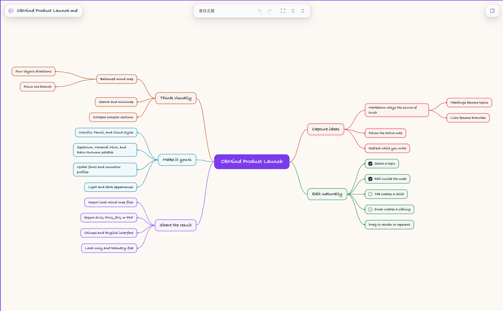
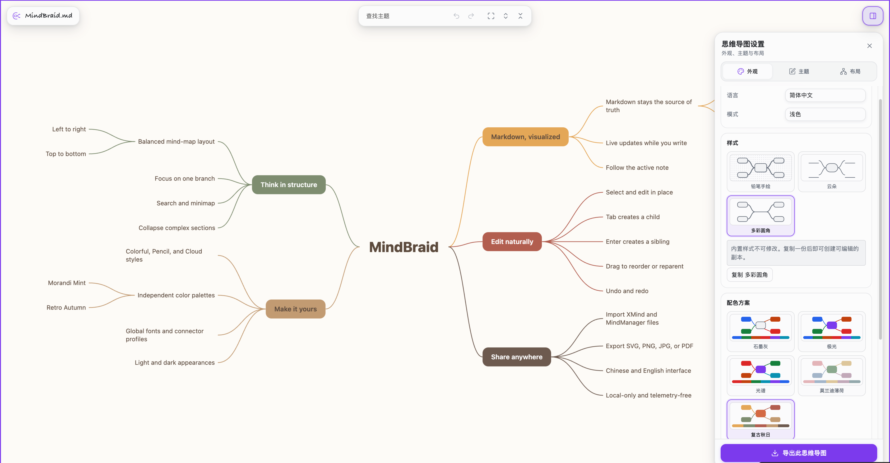
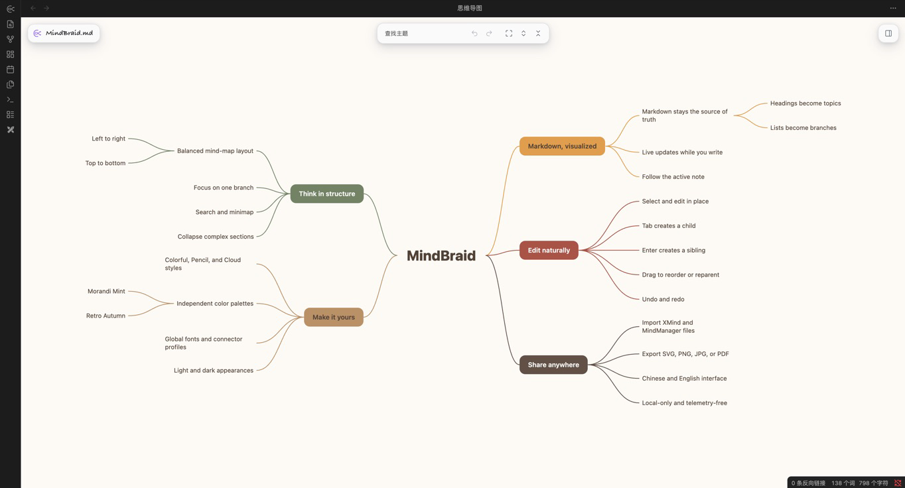
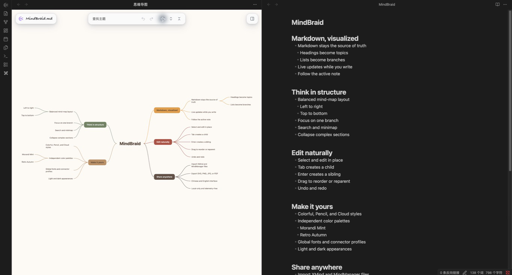
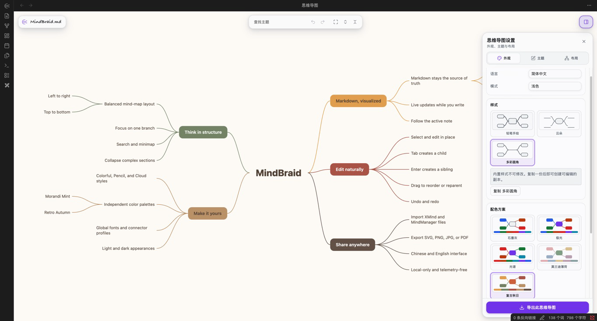

  

<h1 align="center">MindBraid</h1>

<strong>把 Markdown 笔记变成可交互、可编辑的思维导图（mind map）。</strong>

  <a href="README.md">English</a> ·
  <a href="https://github.com/Soren-ac/MindBraid/issues">提交问题</a> ·
  <a href="https://github.com/Soren-ac/MindBraid/releases">发布版本</a>

MindBraid 是一个仅面向桌面端的 Obsidian 插件。它帮助你从视觉上查看、
整理和重构正在编写的笔记。Markdown 始终是唯一的内容源；MindBraid 提供一个
专注的可视化工作区，不会把笔记发送到任何地方。

## 产品展示

同一份由 Markdown 驱动的结构和交互，可以切换为铅笔手绘等不同视觉样式。

样式负责节点形态与视觉处理，配色只改变颜色；两者可在侧栏中独立组合。

## 为什么使用 MindBraid

### Markdown 原生

为当前笔记打开思维导图后，MindBraid 会将 ATX 标题和嵌套的有序、无序列表
转换为节点。导图会跟随当前活动的 Markdown 文件，并在你写作时自动刷新，
因此不需要维护第二份文档。

### 在导图中直接编辑

思维导图不是只读预览，而是可直接工作的视图：

- 单击选中节点；再次单击或双击即可在节点内部编辑。
- 按 `Tab` 新建子节点，按 `Enter` 新建同级节点；新节点会直接进入编辑状态。
- 拖动一个分支即可重新排序，或将它移动为另一个兼容节点的子节点。释放前会
  显示准确的落点预览，避免误改 Markdown。
- 可折叠分支、拖动画布、缩放、搜索当前笔记、聚焦某个分支，并在复杂导图中
  使用小地图定位。
- 支持任务复选框、复制、剪切、粘贴、删除、提升层级、插入父节点，以及经过
  校验的撤销和重做。
- 可在设置侧栏中独立撤销或重做视觉修改，不会混入 Markdown 内容历史。

### 让导图符合你的表达

布局和外观彼此独立。MindBraid 内置平衡式与单侧式布局、四个方向，以及独立的
样式和配色选择器。Colorful、Pencil、Cloud 样式可自由搭配内置配色；还可以
调整全局字体、连接线粗细和连接线轮廓。需要更多结构时，可为节点设置格式、
图标、标记、标签、边界、摘要和关系线。

### 你的笔记始终由你掌控

- MindBraid 只解析当前需要显示的笔记，不会扫描整个 Vault。
- 不访问网络，也不包含遥测。
- 修改外观、布局、折叠状态、视口或其他导图展示选项时，只写入插件数据，
  不会在 Markdown 中插入隐藏元数据。
- 只有明确操作才会修改 Markdown，例如提交行内编辑、新建或拖放节点、切换
  任务状态，或执行明确的节点命令。选中、导航、预览、刷新和外观设置不会
  写入笔记。

## 更多工作方式

**快速定位**：在当前笔记的可见节点中搜索；用键盘浏览树；打开 Vault 内的
链接；或跳转到节点在 Markdown 中对应的源码行。

**只展示需要的内容**：可单独折叠分支，使用面包屑聚焦一个分支，限制可见
层级，并在当前标签的小地图中导航。超大导图首次打开时会自动采用安全的层级
投影，只有明确点击“显示全部”后才渲染所有节点；这一确认仅属于当前标签，不会
修改笔记或保存的展示设置。

**导入与导出**：从本地选择 `.xmind`、`.mind` 或 `.mmap` 文件，先查看预览，
再明确确认创建一份新的 Markdown 笔记。也可将当前快照导出为 SVG、PNG、JPG
或 PDF。导入不会覆盖已有笔记；导出不会修改 Markdown、当前导图或其状态。

**融入 Obsidian**：MindBraid 可跟随 Obsidian 的外观，也可以只在思维导图视图内
强制使用浅色或深色外观。界面提供简体中文和 English；首次安装默认使用简体
中文。

## 安装

MindBraid 需要桌面端 Obsidian `1.7.2` 或更高版本。移动端尚未适配或测试。

### 从 Obsidian 第三方插件市场安装（推荐）

1. 在 Obsidian 中打开 **设置 → 第三方插件**，点击 **浏览**。
2. 搜索 **MindBraid**。
3. 点击 **安装**，然后启用 **MindBraid**。

MindBraid 已上架官方 Obsidian Community Plugins 目录。推荐通过此方式安装，
后续更新也可以直接在 Obsidian 内完成。

### 从 GitHub 发布版本手动安装

1. 从最新[发布版本](https://github.com/Soren-ac/MindBraid/releases)下载
   `main.js`、`manifest.json` 和 `styles.css`。
2. 创建目录 `<你的 Vault>/.obsidian/plugins/obmind/`。
3. 将这三个文件都放入该目录。
4. 重新加载 Obsidian，然后在 **设置 → 第三方插件** 中启用 **MindBraid**。

## 开始使用

1. 打开任意 Markdown 笔记。
2. 点击左侧 Ribbon 中的 MindBraid 按钮，或者从命令面板运行
   **MindBraid: 为当前笔记打开思维导图**。
3. 当前笔记会在新的 MindBraid 标签中打开。拖动空白画布以平移，滚动鼠标滚轮以
   缩放，并通过工具栏使用适应视图、布局、搜索等功能。

所有已打开的 MindBraid 标签都会跟随当前活动的 Markdown 文件。非 Markdown
文件会显示说明状态，而不会被强行解析。

## 支持的 Markdown

文件名会成为中心节点。当前支持展示：

- `#` 到 `######` 的 ATX 标题，包括跳级标题。
- 以 `-`、`*` 或 `+` 开头的无序列表项。
- 以 `1.` 等数字加点开头的有序列表项。
- 根据缩进推断层级的嵌套列表。

列表会挂载到最近的前置标题；如果没有标题，则挂载到文档根节点。YAML
frontmatter、普通正文、引用块、围栏或缩进代码，以及当前不支持的 Markdown
结构不会作为节点显示。

## 当前限制

- MindBraid 仅适用于桌面端，尚未提供面向移动端的思维导图体验。
- 它实现的是实用的 Markdown 子集，而非完整 CommonMark：Setext 标题、复杂的
  列表续行、惰性引用和 HTML 块语义不会转换为节点。
- 节点内编辑会保守地处理行内 Markdown：只有在源码映射明确时保留受支持的行内
  格式；否则会安全写回该节点的转义可见文本。
- 大型导图会先启用当前标签独立的层级保护，并裁剪视口外元素。明确选择“显示
  全部”后仍可能变慢，因为布局计算当前仍在主线程执行。

## 隐私与内容修改边界

MindBraid 以本地优先方式工作：不会上传笔记、请求网络资源或收集遥测数据。它不
扫描整个 Vault，只处理当前笔记。

视觉选项会以 MindBraid 插件数据保存，不会写入 Markdown。相对地，明确提交的
节点编辑、新建、结构拖放、任务切换和受支持的节点命令会有意更新源笔记。每次
写入前，MindBraid 都会校验当前源码映射，避免应用过期操作。编辑根节点会通过
Obsidian 重命名 Markdown 文件；Obsidian 是否同步更新指向该文件的链接，取决
于你的链接更新设置。

## 获取帮助与参与贡献

请在 [Issue 区](https://github.com/Soren-ac/MindBraid/issues) 提交可复现的问题。
建议附上 MindBraid 和 Obsidian 版本、操作系统、最小 Markdown 示例以及最短复现
步骤。请不要附上与问题无关的私有 Vault 内容。

实现细节和可替换前端的扩展约定请见
[前端契约](FRONTEND_CONTRACT.md)。第三方依赖声明请见
[THIRD_PARTY_NOTICES.md](THIRD_PARTY_NOTICES.md)。

## 许可证

MindBraid 采用 [MIT License](LICENSE)。打包使用的开源软件声明见
[THIRD_PARTY_NOTICES.md](THIRD_PARTY_NOTICES.md)。
